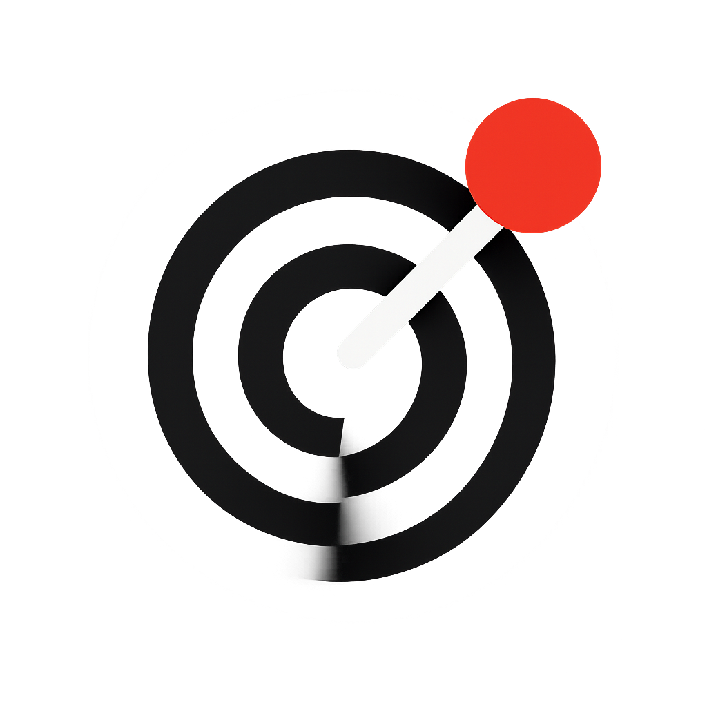

<p align="center">
  
</p>

<h1 align="center">Sagu plugins</h1>

<p align="center"><strong>Agent-facing intelligence from your radars.</strong></p>

<p align="center">
  Connect agents to <a href="https://sagu.app">Sagu</a> radars, pings, and
  artifacts over MCP. List and search radars, export agent-ready context packets,
  refresh intelligence on demand, and create or fetch platform artifacts.
</p>

<p align="center">
  <a href="https://sagu.app">sagu.app</a> ·
  MCP: <code>https://sagu-mcp.luke-nittmann.workers.dev/mcp</code>
</p>

---

## Install

<!-- AUTO-GENERATED:INSTALL START -->

### Any agent (npx skills)

Works across Claude Code, Cursor, Codex, Copilot, Windsurf, and 10+ skill-aware agents.

```sh
npx skills add creative-int/sagu-plugins
```

### Claude Code

Add the marketplace, then install the Sagu plugin.

```sh
/plugin marketplace add creative-int/sagu-plugins
/plugin install sagu@sagu
```

### Codex

Add this repo as a Codex plugin marketplace, then install from /plugins.

```sh
codex plugin marketplace add creative-int/sagu-plugins
```

### Cursor

Install Sagu from the Cursor plugin marketplace.

```sh
Cursor → Settings → Plugins → Add marketplace → creative-int/sagu-plugins
```

### Any remote MCP client (Cline, Windsurf, Zed, VS Code, generic)

Point your client at the remote Sagu MCP server.

```json
{
	"mcpServers": {
		"sagu": {
			"url": "https://sagu-mcp.luke-nittmann.workers.dev/mcp"
		}
	}
}
```

### Local stdio MCP client

Run the Sagu stdio MCP server locally with your Sagu API key.

```json
{
	"mcpServers": {
		"sagu": {
			"command": "npx",
			"args": [
				"-y",
				"@sagu/mcp"
			],
			"env": {
				"RADAR_API_KEY": "sagu_sk_your_key_here"
			}
		}
	}
}
```

<!-- AUTO-GENERATED:INSTALL END -->

To preview the available skills without installing:

```sh
npx skills add creative-int/sagu-plugins --list
```

## Included skills

- **`sagu-dispatch`** — list and search radars, read pings, export agent-ready
  context packets, refresh intelligence, and ask questions in radar threads.
  Also answers to `monitor` and `radar`.
- **`sagu-artifact`** — create and fetch platform artifacts, extract
  format-matched dispatch artifacts from pings, and evolve radar knowledge.
  Also answers to `artifact` and `share`.

Skills live under [`skills/`](skills/).

## MCP tools

See the tool surface documented in [`sagu.config.ts`](sagu.config.ts). Tools are
hosted by the Sagu MCP server (`packages/mcp` stdio + `apps/mcp` remote) and
include radars, pings, artifacts, research, and knowledge-graph operations.

## Develop

```sh
pnpm install
pnpm generate        # regenerate all adapters from sagu.config.ts
pnpm verify          # drift check + typecheck + MCP reachability smoke
```

## License

[MIT](LICENSE) © creative-int
